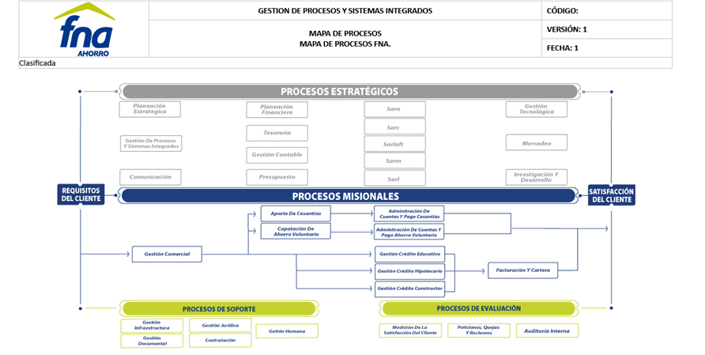

SHA ${TRIGGERING_SHA_7}

|Tema|Vista de Contexto: **Objetivos del Diagnóstico SOA y Productos, Áreas, y Procesos FNA Objeto del Diagnóstico**|
|----|---------------------------------------------------------------------------|
|Palabras clave|SOA, Contexto, Áreas, Procesos, Objetivos
|Autor||
|Fuente||
|Version|$COMMIT del $FECHA_COMPILACION|
|Vínculos|[N001d. Ejecución Plan de Trabajo SOA](onenote:#N001d.%20Ejecución%20Plan%20de%20Trabajo%20SOA&section-id={F3AC64B8-D6FF-47C7-ABBE-A2B4B6510F0F}&page-id={45CC9047-3DB4-4CFD-BCA1-D9619F4A0C4D}&end&base-path=https://uniandes-my.sharepoint.com/personal/ha_wong10_uniandes_edu_co/Documents/Blocs%20de%20notas/Harry%20Alfredo%20@%20Work/SOA/Trabajo%20SOA.one) [N003a. Procesos de Negocio FNA](onenote:#N003a.%20Procesos%20de%20Negocio%20FNA&section-id={F3AC64B8-D6FF-47C7-ABBE-A2B4B6510F0F}&page-id={DAE4ECE3-B936-461D-A468-83492014F7F7}&end&base-path=https://uniandes-my.sharepoint.com/personal/ha_wong10_uniandes_edu_co/Documents/Blocs%20de%20notas/Harry%20Alfredo%20@%20Work/SOA/Trabajo%20SOA.one)|
|||

 

# Vista de Contexto SOA FNA (181-2020)
## Objetivos del diagnóstico SOA y Productos, Áreas Procesos FNA Objeto del Diagnóstico
La vista de contexto presenta una visión de la empresa ajustada a aquellas partes que entran en el alcance de este proyecto, 181-2020, diagnóstico SOA FNA. 

Esta vista informa al Fondo Nacional del Ahorro (FNA, en adelante) dos temas: primero, que el ejercicio actual, aunque utilice una visión empresarial, no puede abarcar a la completitud de la empresa, sino que hace foco en las partes indicadas que son relevantes según las restricciones de ejecución y de resultados esperados del proyecto. Segundo, la vista de contexto comunica las problemáticas (que a la vez son objetivos de solución) a los que le apuntarán los diagnósticos de este proyecto.

 

# Detalles de la Vista de Contexto SOA FNA (181-2020)
## Objetivos de la Consultoría: Problemática y Diagnósticos

La consultoría SOA (proyecto 181-2020) tratará tres problemáticas importantes de Fondo Nacional del Ahorro (FNA):

1. OBJ1. Independencia de proveedor
1. OBJ2. Flexibilidad y tiempo de mercado
1. OBJ3. Fortaleza SOA de las aplicaciones del FNA

**Nota**: Gobierno SOA del FNA lo establecemos como uno de los resultados (un producto de trabajo) que entregaremos al FNA, no como un objeto de la consultoría.

Estos objetivos fueron seleccionados según la relación valor entregado y tiempo de la consultoría, lo cual significa que estos objetivos entregan el nivel de conveniencia de los resultados que puedan desarrollarse en el tiempo de ejecución de este ejercicio.

Estos objetivos también son imporatntes porque sirven a la vez como los objetos de los diagnósticos que realizaremos en este poryecto de consultoría. 

## Productos del FNA Objetos del Diagnóstico

Esta consultoría considera como entradas para los diagnósticos a los productos de negocio del FNA siguientes:

1. Cuenta AVC (ahorro voluntario)
1. Cesantías
1. Crédito
1. Cartera

Los demás productos de negocio del FNA serán tratados únicamente cuando su relación con estos los haga relevantes según los requiera o bien un diagnóstico, o bien los objetivos de esta consultoría y del Fondo.

## Áreas de Negocio del FNA Objetos del Diagnóstico

Con base a los productos de negocio de la FNA seleccionados, las áreas del FNA que competen a esta consultoría y a los objetivos de los diagnósticos son: 

1. Vicepresidencia de Crédito
1. Vicepresidencia de Operaciones

La áreas debajo de estas, como por ejemplo, la Gerencia de Crédito Individual para el caso de la primera, o la Gerencia de Cartera, serán relacionadas en tanto se vean impactadas por un diagnóstico en marcha, o los objetivos de este consultoría y del Fondo.

### Referencia

## Procesos de Negocio Objetos del Diagnóstico
Los procesos de negocio seleccionados por este proyecto SOA son aquellos relacionados con los productos de negocio objetos de esta consultoría, por ejemplo,

1. PROC1. Administración de Cuentas y Pago de Cesantías (CSNT)
2. PROC2. Gestión Crédito
    - PROC2.1. Gestión Crédito Educativo
    - PROC2.2. Gestión Crédito Hipotecario
    - PROC2.3. Gestión Crédito Constructor
3. PROC3. Facturación y Cartera

### Referencia

***
