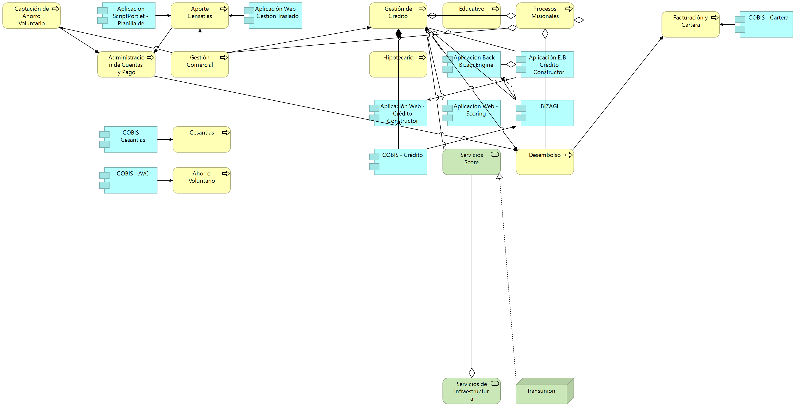

|Tema|Vista de Segmento: Partes de la empresa FNA selecionados por su relación con la Vista de Contexto
|----|-------------------------------------------|
|Palabras clave|SOA, Contexto, Segmento FNA, Áreas, Procesos, Aplicaciones, Servicios
|Autor||
|Fuente||
|Version|$COMMIT del $FECHA_COMPILACION|
|Vínculos|[Vista de Contexto](onenote:#N003a.%20Procesos%20de%20Negocio%20FNA&section-id={F3AC64B8-D6FF-47C7-ABBE-A2B4B6510F0F}&page-id={DAE4ECE3-B936-461D-A468-83492014F7F7}&end&base-path=https://uniandes-my.sharepoint.com/personal/ha_wong10_uniandes_edu_co/Documents/Blocs%20de%20notas/Harry%20Alfredo%20@%20Work/SOA/Trabajo%20SOA.one); [N003a. Procesos de Negocio FNA](onenote:#N003a.%20Procesos%20de%20Negocio%20FNA&section-id={F3AC64B8-D6FF-47C7-ABBE-A2B4B6510F0F}&page-id={DAE4ECE3-B936-461D-A468-83492014F7F7}&end&base-path=https://uniandes-my.sharepoint.com/personal/ha_wong10_uniandes_edu_co/Documents/Blocs%20de%20notas/Harry%20Alfredo%20@%20Work/SOA/Trabajo%20SOA.one)|
|||

# Vista Segmento SOA FNA 181-2020

La vista de segmento presenta la lista de las partes seleccionadas de la empresa que serán objeto de esta consultoría (proyecto 181-2020) y sobre las que se desarrollarán los procesos de análisis, brecha, hoja de ruta, y demás de esta consultoría. Es una lista filtrada de todas las partes de la empresa, y por tanto, *esta vista define el alcance horizontal del diagnóstico SOA*.

## Partes de la Empresa FNA objeto del diagnóstico SOA

Estas partes han sido seleccionadas por tener relación directa con los elementos de la vista de contexto (Ver Vista de Contexto), lo cual significa que estas partes están vinculadas, o bien con alguno de los productos de negocio o con alguno de los procesos de negocio, o con los demás elementos de la vista de contexto. 

    La "Aplicación Web Gestión Traslado" ha sido seleccionada como parte de la empresa FNA por su relación con el proceso de negocio "Aporte Cesantías". A su vez, el proceso de negocio "Aporte Cesantías" tiene que ver en forma directa con uno de los cuatro (4) productos de la vista de contexto: Cesantías. 
    
    Esto explica porqué la aplicación indicada ha sido seleccionada por el segmento de la empresa FNA objeto del diagnóstico.

Las partes de la empresa que conforman el segmento FNA a diagnosticar.

* [Aporte Censatias (Business Process)](#aporte-censatias-business-process)
* [Administración de Cuentas  y Pago (Business Process)](#administración-de-cuentas--y-pago-business-process)
* [Gestión Comercial (Business Process)](#gestión-comercial-business-process)
* [Gestión de Credito (Business Process)](#gestión-de-credito-business-process)
* [Educativo (Business Process)](#educativo-business-process)
* [Procesos Misionales (Business Process)](#procesos-misionales-business-process)
* [Hipotecario (Business Process)](#hipotecario-business-process)
* [Cesantias (Business Process)](#cesantias-business-process)
* [Desembolso (Business Process)](#desembolso-business-process)
* [Facturación y Cartera (Business Process)](#facturación-y-cartera-business-process)
* [Ahorro Voluntario (Business Process)](#ahorro-voluntario-business-process)
* [Captación de Ahorro Voluntario (Business Process)](#captación-de-ahorro-voluntario-business-process)
* [Aplicación ScriptPortlet - Planilla de Consignación (Application Component)](#aplicación-scriptportlet---planilla-de-consignación-application-component)
* [Aplicación Web - Gestión Traslado (Application Component)](#aplicación-web---gestión-traslado-application-component)
* [COBIS - Cesantias (Application Component)](#cobis---cesantias-application-component)
* [Aplicación Back - Bizagi Engine (Application Component)](#aplicación-back---bizagi-engine-application-component)
* [Aplicación EJB - Credito Constructor  (Application Component)](#aplicación-ejb---credito-constructor--application-component)
* [Aplicación Web - Crédito Constructor (Application Component)](#aplicación-web---crédito-constructor-application-component)
* [Aplicación Web - Scoring (Application Component)](#aplicación-web---scoring-application-component)
* [BIZAGI (Application Component)](#bizagi-application-component)
* [COBIS - Crédito (Application Component)](#cobis---crédito-application-component)
* [Servicios Score (Technology Service)](#servicios-score-technology-service)
* [COBIS - Cartera (Application Component)](#cobis---cartera-application-component)
* [COBIS - AVC (Application Component)](#cobis---avc-application-component)
* [Servicios de Infraestructura (Technology Service)](#servicios-de-infraestructura-technology-service)
* [Transunion (Node)](#transunion-node)

 

**Nota**: las partes que se hagan faltan en la vista de segmento carecen de relación en los modelos de la empresa. Para que aparezcan en la vista de segmento es necesario actualizar los modelos de la empresa: modelos de negocio, procesos, servicios, aplicaciones e infraestructura.

***
