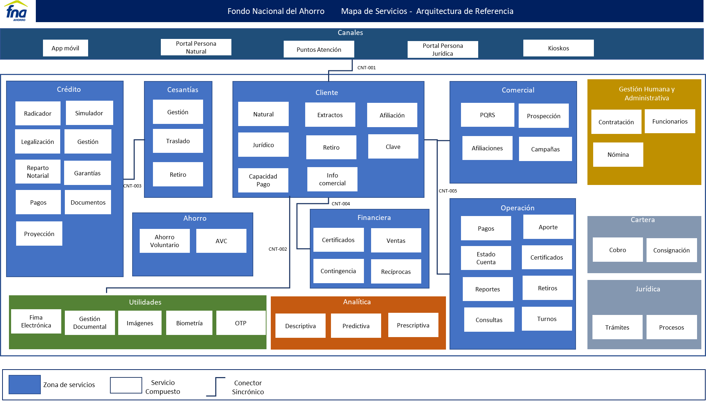

|Tema|Catálogo de Servicios SOA: **Vista Funcional**
|----|-------------------------------------------------|
|Palabras clave|SOA, Áreas, Capacidades, Servicios, Conectores|
|Autor||
|Fuente||
|Version|$COMMIT del $FECHA_COMPILACION|
|Vínculos|[N003e. Catálogo de Servicios FNA-1a](https://stefaninilatam.sharepoint.com/:t:/s/PROYECTOARQUITECTURAE-SERVICEFNA/EXsxpcx6LllArdNIqf_wo4gBA0ZcHltkYlP5tJ4NAMNOhw?e=fRnq01); [N003e. Catálogo de Servicios FNA-4](https://stefaninilatam.sharepoint.com/:t:/s/PROYECTOARQUITECTURAE-SERVICEFNA/EQuW5UeV26lCryG3lpR68f4BxFCRNCKRKngm6dc4sRjGgQ?e=ZaFIcn)|

 

## Descripción de la Vista Funcional (arquitectura de referencia)
La vista funcional presenta los servicios que deben hacer parte del portafolio SOA del Fondo Nacional del Ahorro (en adelante FNA). Por tanto, funciona a la vez como una arquitectura de referencia a la que hay que fortalecer, comparar, desarrollar y vigilar.

[Imagen. ]() Vista funcional basada en mapa de servicios.

_Fuente: elaboración propia._

>La vista funcional es importante porque presenta los _servicios SOA independientes de la tecnología y del proveedor_ que soportan a las áreas del FNA objeto de este diagnóstico. Por esta razón, esta vista sirve también como instrumento para _controlar la alineación del portafolio de servicios con las áreas de negocio de la empresa FNA_ objeto de este diagnóstico. Con la vista funcional SOA podremos más adelante soportar a las áreas y a los requerimientos claves del FNA.

 

Resaltamos que a partir de esta vista es necesario establecer las relaciones internas de esta arquitectura de referencia con las partes de la empresa que hacen parte de la vista de segmento (ver [N003a Vista Segmento SOA FNA](N003a%20Vista.md)), que es una colección de las partes clave de la empresa y que a la vez son relevantes para este diagnóstico. 

Una vez mostramos las capacidades SOA que soportan a las áreas de negocio objeto de este diagnóstico, el ejercicio siguiente es listar los conectores necesarios para articular estas capacidades. Esta vista debemos intersectarla con la vista de segmento de la empresa ([01a2.Vista Segmento SOA FNA](01a2.Vista Segmento SOA FNA)) para desarrollar las partes del FNA con la que vamos a dar cumplimiento a esta arquitectura de referencia.

 

## Conectores de las Capacidades (arquitectura de referencia)
Los conectores que dinamizan la interacción entre los servicios independientes de la tecnología y de proveedor aparecen en la vista como líneas de conexión entre las capacidades de esta arquitectura de referencia.

Describimos las características de estos conectores con los siguientes ejemplos.

[Imagen. ]() Conectores que dinamizan la interacción entre los servicios independientes.

_Fuente: elaboración propia._

**Importante**. Los modelos del FNA carecen de información de los conectores entre las capacidades de negocio del FNA. Esto impacta la manera cómo una capacidad soporta a otra, a la vez que dificulta controlar las tecnologías y estándares involucradas en tales conexiones.
