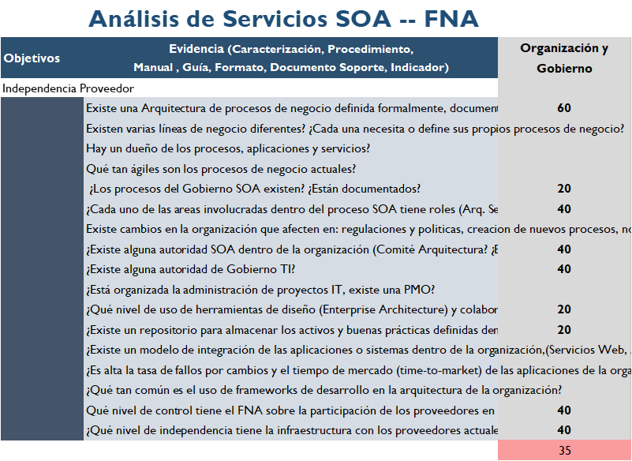

|Tema|Resultados y métricas del diagnóstico de madurez SOA: **Todos los Dominios**
|----|-------------------------------------------------|
|Palabras clave|SOA, Madurez, Gobierno, Efectividad, Costos|
|Autor||
|Fuente||
|Version|$COMMIT del $FECHA_COMPILACION|
|Vínculos|[N011. Estudio de Madurez SOA FNA -3 Anexos](N005a.%20Vista%2de%2Integración%2FNA-1.md) \| [Portafolio de Servicios SOA, Tipos de Servicios y Distribución de servicios SOA](N003e.%20Catálogo%20de%20Servicios%20FNA-3.md)|

 

## Resultados y Métricas del Diagnóstico de Madurez SOA
Desde la perspectiva de madurez SOA, la primera iteración del proceso de evaluación de madurez SOA del FNA determina que el _FNA es una empresa reactiva_, resultado además que es consistente en todas las dimensiones de OSIMM diagnosticadas (negocio, aplicaciones, gobierno, etc.).

El puntaje obtenido en todas las dimensiones es inferior a 40 puntos (gráfico de radar), lo que la ubica como una empresa SOA de nivel **Realizado**. El detalle de los puntajes obtenido en cada dimensión se encuentra en la tabla de resultado junto con el gráfico de resumen.

|                             |                                  |
|-----------------------------|----------------------------------|
|  |  |

[Imagen. ]() Resultados y métricas del diagnóstico de madurez SOA. Todos los dominios.

_Fuente: herramienta de diagnóstico de madurez SOA. Elaboración propia_.

>**Nota**. SOA responde con esfuerzo a las exigencias de negocio del FNA debido a las dificultades de dependencia a proveedores y la falta de flexibilidad de las respuestas.

 

### Puntos de Mejora. Resultado del Primer Diagnóstico
La dimensión que tuvo puntajes meritorios fue la de Negocio (37 puntos) cuyo valor alcanzó el segundo percentil de eficacia: 37 / 100. Este índice sintetiza el hecho de que operativamente SOA responde a las exigencias de negocio del FNA, pero con esfuerzos altos que seguramente afectan el retorno de inversión SOA. 

Según los resultados internos del diagnóstico, los problemas del alto esfuerzo en la eficacia de la dimensión de negocio es causado por las dificultades siguientes: 
1. El bajo grado de independencia de proveedor: (ver imagen abajo) _38 puntos / 100 puntos_
1. Muy baja flexibilidad y tiempos de entrega (time-to-market): _20 / 100 puntos_. 

[Imagen. ]() Resultados Según los resultados internos del diagnóstico. Dimensión de Negocio.

_Fuente: herramienta de diagnóstico de madurez SOA. Elaboración propia_.

>**Nota**. Estas dos problemáticas deben las ser primeras en ser atendidas en un futuro gobierno SOA del Fondo.

 

A continuación exponemos otros resultados de este primer resultado del diagnóstico de madurez SOA, y lo que estos significan para la empresa.

 

## Consideraciones y Conclusiones Respecto a Adopción SOA
Este primer diagnóstivo de madurez SOA del FNA, cuyo resultado hoy es el nivel SOA Realizado, _significa que el FNA requiere de 1 a 3 años_ para aumentar el alcance de adopción SOA. El prolongado tiempo se explica porque el cambio debe suceder gradualmente, en varias iteraciones, em donde la cantidad de iteraciones, la longitud y la ubicación dentro de la empresa variarán según los recursos de ejecución que el Fondo le dé a esta problemática.

>**Nota**. El futuro gobierno SOA, en conjunto con el plan de la Dirección de Tecnología del FNA, y el próximo plan estratégico (febrero del 2023) debe procurar la ejecución y los recursos necesarios para la realización de estas iteraciones que tienen por objeto mover la adopción SOA del Fondo al siguiente estadio: mayor a 50 puntos de madurez SOA.

 

## Consideraciones y Conclusiones Respecto a la Arquitectura SOA
Si bien existe una arquitectura SOA en el FNA, lo cual es bueno para los objetivos tanto de negocio como de tecnología, _esta no está optimizada para cumplir un objetivo particular_, sea flexibilidad, reutilización, composición; o printicpio SOA, como el de retorno de inversión. Los niveles de las capacidades de arquitectura, según lo muestra el resultado del diagnóstico (_28 / 100. Ver imagen Resultados y métricas del diagnóstico de madurez SOA_), esta existe únicamente para cumplir lo mínimo exigido, pero no para alcanzar un objetivo o tecnológico o de negocio distinto a eso.

>**Nota**. Para aumentar las capacidades de la arquitectura es necesario realizar un análisis de capacidades de la arquitectura que responda a las capacidades del negocio (alineación negocio, arquitectura). De igual nivel de importancia que el caso anterior, esta problemática del aumento de las capacidades debe hacer parte de los planes de la Dirección de Tecnología del FNA y del próximo plan estratégico (febrero del 2023).

 

## Consideraciones y Conclusiones Respecto al Gobierno SOA
El gobierno SOA para el Fondo debe tener un enfoque inicial claro: vigilancia del costo, efectividad y factibilidad SOA.

Con este enfoque, el gobierno SOA futuro debe lograr, primordialmente, aumentar el índice de independencia de proveedor del Fondo. El resultado interno (ver imagen abajo) en la dimensión de Gobierno obtuvo el puntaje más bajo en este análisis: _35 / 100 puntos_ (los otros análisis, flexibilidad y fortaleza SOA, en esta misma dimensión obtuvieron en promedio 40 puntos).

[Imagen.]() Resultados Según los resultados internos del diagnóstico. Dimensión de Gobierno.

_Fuente: herramienta de diagnóstico de madurez SOA. Elaboración propia_.

 

>**Nota**. Las consecuencias que usualmente se extraen de este índice deben ser consideradas por el Fondo: costos de monitoreo altos, y la más problemática, inefectividad de costo SOA, que es la relación entre los costos a los que ascienden las tecnologías y las implementaciones de SOA para cubrir únicamente necesidades de integración, que para el caso del Fondo, también son sujeto de mejoras.

 

