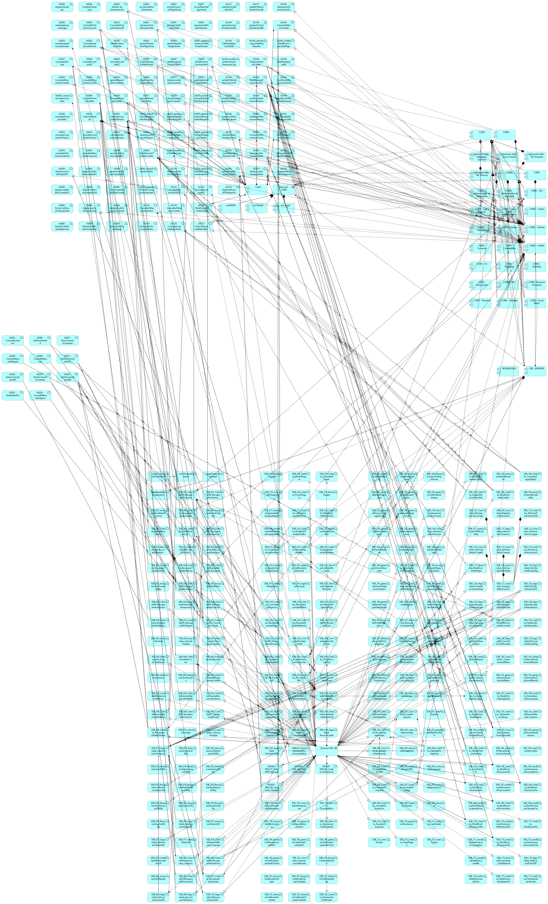

|Tema|Resultado del Diagnóstico Situación Actual SOA del FNA: **Análisis de las Fortalezas SOA del FNA**
|----|-------------------------------------------------|
|Palabras clave|SOA, Situación actual, Tecnología|
|Autor||
|Fuente||
|Version|$COMMIT del $FECHA_COMPILACION|
|Vínculos||

 

## Análisis de las Fortalezas SOA del FNA
Para mejorar las fortalezas SOA es necesario subsanar los problemas de acoplamiento del proveedor Cobis a las capacidades de negocio del FNA, y mantener bajo control los grados de dependencia de los servicios SOA que evidenció la revisión del portafolio de servicios SOA del FNA. Pero también existen otras problemáticas de igual importancia.

A continuación, un resumen de las problemática más importantes encontradas en el portafolio de servicios SOA de la empresa.

1. Acoplamiento de las capacidades de negocio del FNA a COBIS. _Existen más de 96 relaciones_ entre las capacidades de negocio y las herramientas de software de Cobis (ver [N003e. Catálogo de Servicios FNA-1](N003e.CatálogodeServiciosFNA-1.md), y [N003e. Catálogo de Servicios FNA-2](N003e.CatálogodeServiciosFNA-2.md)). 

    * Todo acoplamiento, que en este caso es con el proveedor, produce rigidez. Esta rigidez es causa de una problemática que afecta, en primer grado a la flexibilidad de negocio, y segundo, al tiempo de mercado.

1. El grado de relación de dependencia de las aplicaciones proveedoras de servicios es alto y requiere de intervención y un gobierno que prevenga y controle su aumento. Esta situación tiene equivalencia en otra rama de la gestión: en la gestión de bases de datos sucede que la proliferación de índices, que aumentan el desempeño de las operaciones de consulta, degrada el desempeño de las operaciones de modificación. El administrador de base de datos debe impedir que la creación de índices afecte al desempeño de la base. Similar situación ocurre en el portafolio SOA del Fondo. El aumento de la cantidad de relaciones entre los servicios del portafolio causa problemas, no tanto de degradación, sino de mantenimiento y rigidez al cambio. _Aplicaciones como Cobis Clientes y Cobis Cartera suman más de 60 relaciones con otros servicios_ (ver [N003e. Catálogo de Servicios FNA-2.md](N003e.CatálogodeServiciosFNA-2.md)). _En total, el grupo de aplicaciones de Cobis suma más de 100 relaciones a servicios SOA del portafolio del Fondo_.

    * Esto implica que los esfuerzos de realizar cambios evolutivos, optimización, o de mantenimiento se acrecienten: un cambio en una aplicación con alto grado de dependencia requiere asegurar la calidad (QA) de las n-relaciones que esta tenga con los servicios del portafolio SOA. Lo mismo que termina efectando al tiempo de mercado. Ver anexo 1.

1. Por último, y al contrario de la cantidad creciente de relaciones de los servicios por administrar (más de 100 relaciones de aplicaciones a servicios), _el nivel de relación de los servicios con los requerimientos de las vicepresidencias de Crédito y la vicepresidencia de Operaciones evidenciada en los modelos del FNA es baja_ (ver [N003e. Catálogo de Servicios FNA-1a](N003e.CatálogodeServicios.md)). 
 
    * La baja relación de los requerimientos con las áreas complica la gestión de las demanda y afecta a la eficacia del portafolio de servicios que empieza a llenarse de servicios de tipo intermediarios o servicios utilitarios, que terminan consumiendo  mayores recursos que los servicios de negocio, que son los que responden a las áreas de negocio en sus términos.

 

Otra problemática de tipo general, porque agrava todas las anteriores, es que el repositorio de arquitectura del Fondo presenta redundancias y desactualizaciones que causan dificultades al entendimiento de los conceptos y modelos de arquitectura del FNA. Encontrar un modelo o un concepto repetido entre todas las consultorías anteriores (UT Heinsohn-Asesoftw.), o que un concepto esté nombrado de una manera en uno y distintos en otra, o que este esté desacralizados causa dificultad para entender la información que los modelos quieren comunicar y, por ende, complican los análisis que se realizan sobre estos.

 

### Anexo 1. Interdependencias del Portafolio FNA
Relaciones entre servicios SOA del portafolio y relaciones de servicios con aplicaciones del Fondo.

[Imagen. ]() Interdependencias del Portafolio FNA.

_Fuente: Portafolio Unificado Servicios FNA 0.0.1.xlsx_
