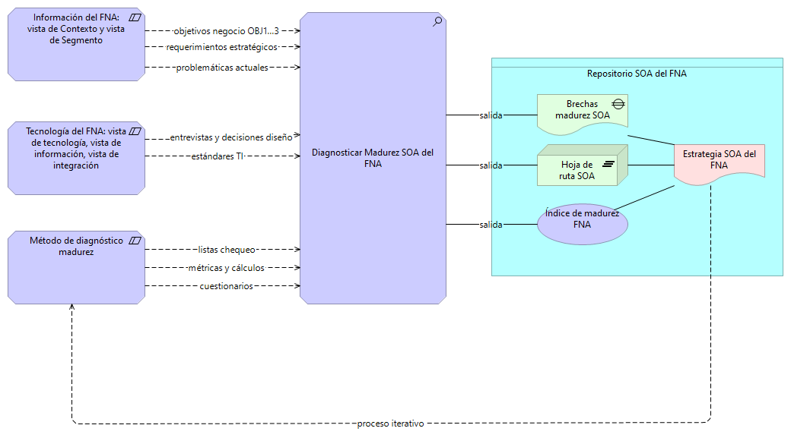

|Tema|Presentación del Análisis de Madurez SOA del FNA: **Proceso de Evaluación de Madurez**
|----|-------------------------------------------------|
|Palabras clave|SOA, Madurez, OSIMM, Efectividad, Arquitectura, Procesos|
|Autor||
|Fuente||
|Secuencia|Padre Hijo|
|Vínculos|[N005a. Vista de Integración FNA-1](N005a.%20Vista%2de%2Integración%2FNA-1.md) \| [Portafolio de Servicios SOA, Tipos de Servicios y Distribución de servicios SOA por Tipo](N003e.%20Catálogo%20de%20Servicios%20FNA-3.md)|

 

## Presentación del Análisis de Madurez SOA del FNA
El ejercicio de madurez a realizar tiene por objeto cuantificar la efectividad de la arquitectura SOA actual, así como la de los procesos usuales de SOA, como por ejemplo, el proceso de gobierno SOA. _Medir la madurez en términos de efectividad es necesario si queremos mover el estado de la arquitectura SOA actual y la de los procesos SOA hacia un estado objetivo de independencia de proveedor, flexibilidad de negocio y tiempo demercado, y fortalecimiento SOA_.

El método para el análisis de madurez incorpora las siguientes consideraciones:
1. Alcance de la adopción SOA en el Fondo
1. Niveles de las capacidades de la arquitectura SOA del Fondo
1. Descripción de los estados deseados, o estadios SOA
1. Implicaciones del retorno de inversión tecnológica 
1. Vigilancia del costo, efectividad y factibilidad SOA

 

## Proceso de Evaluación de Madurez
El proceso de diagnóstico y evaluación de madurez SOA aplicado en el Fondo es acotado e iterativo. _El objetivo de este proceso es realizar varias iteraciones de evaluación de madurez y en cada una aportar a la estrategia SOA del Fondo_.

En resumen, las vistas elaboradas en el diagnóstico de la situación actual SOA (PR1) en esta consultoría sirven de entrada para el proceso. Particularmente, 

1. Sesiones de descripción del negocio, organización y visión estratégica: intención, productos, clientes y mercado, requerimientos estratégicos
1. Entrevistas con ingenieros del Fondo (estándares de TI, decisiones diseño)
1. Cuestionarios de evaluación (aspectos SOA)
1. Listas de chequeo SOA (implementación SOA)

Imagen del proceso de diagnóstico y evaluación de madurez SOA. Entradas, salidas y afectación a la estrategia SOA en cada iteración.

[Imagen. ]() Proceso iterativo de diagnóstico de madurez SOA influye en la estrategia SOA.

_Fuente: elaboración propia._

 
Las partes resultantes de la evaluación, sean listas, matrices, conclusiones, diagramas, estrategias, entre otros, deben residir en el repositorio SOA del Fondo.

