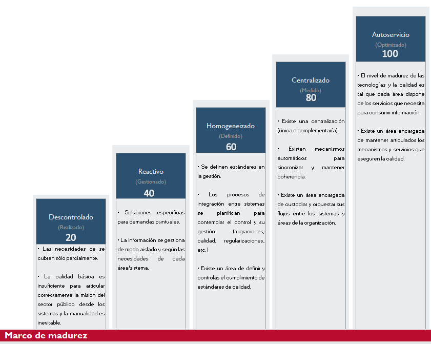

|Tema|Presentación del Análisis de Madurez SOA del FNA: **Adaptación del Diagnóstico de Madurez SOA a la Empresa FNA**
|----|-------------------------------------------------|
|Palabras clave|SOA, Madurez, Método, OSIMM, Adaptación|
|Autor||
|Fuente||
|Secuencia|Padre [N007. Presentación del Análisis de Madurez-1](N007.%20Presentación%20del%20Análisis%20de%20Madurez-1) \| Hijo|
|Vínculos|[N005a. Vista de Integración FNA-1](N005a.%20Vista%2de%2Integración%2FNA-1.md) \| [Portafolio de Servicios SOA, Tipos de Servicios y Distribución de servicios SOA por Tipo](N003e.%20Catálogo%20de%20Servicios%20FNA-3.md)|

 

## Adaptación del Diagnóstico de Madurez SOA a la Empresa FNA
El método de diagnóstico de madurez SOA seleccionado (SOCIMM, del Open Group) ha sido adaptado al FNA según la información con la que cuenta el repositorio documental surtido a esta consultoría, y para que pueda ser usado por el proceso de evaluación descrito anteriormente [N007. Presentación del Análisis de Madurez-1](N007.%20Presentación%20del%20Análisis%20de%20Madurez-1.md). 

El método OSIMM adaptado al FNA consta de dos partes.
1. Evaluación de **Resultado SOA**: objetivos y dimensiones del FNA
1. Evaluación **Arquitectura SOA**: capacidades de los servicios SOA

En la evaluación de Resultado SOA la empresa es el objeto a evaluar. Esta evaluación observa a la empresa FNA desde los objetivos de la consultoría (OBJ1. Independencia de proveedor...) y las vistas de contexto, y de segmento desarrolladas anteriormente. Finalmente, constrasta esta información con siete perspectivas (a las que el método llama dimensiones) conel fin de asignar un puntaje a cada una de estas: Negocio, Organización y Gobierno, Procedimientos (Método), Aplicaciones, Arquitectura, Información, Infraestructura.

Ejemplo de la evaluación Resultado SOA adaptada al FNA.

[Imagen.]() Evaluación de Resultado SOA. Dimensiones seleccionadas para el diagnóstico SOA.

_Fuente: elaboración propia._

 

En cambio, en la segunda parte del médoto, la evaluación Arquitectura SOA, el objeto observado son los servicios SOA. Lo que hace esta evaluación es una caracterización de los servicios del FNA en función de atributos de calidad que deben estar presentes en los servicios.

Ejemplo de la evaluación Arquitectura SOA adaptada al FNA.

[Imagen.]() Evaluación de Arquitectura SOA. Capacidades de los servicios SOA.

_Fuente: elaboración propia._

 

Al conjugar de estas dos evaluaciones es la que produce finalmente un índice de eficacia SOA, también llamdado, nivel de madurez SOA del FNA.

Ejemplo del resultado de las dos evaluaciones SOA.

[Imagen.]() Índice de eficacia SOA, también llamdado, nivel de madurez SOA del FNA.

_Fuente: elaboración propia._

 

## Cuestionarios del Análisis de Madurez SOA Adaptado al FNA
Los cuestionarios del método de evaluación de madurez SOA del FNA han sido ajustados para responder a los objetivos de la consultoría, estos son, Independencia de proveedor (OBJ1), Fortaleza SOA de las aplicaciones (OBJ2), y el Flexibilidad y Tiempo de mercado (OBJ3).

### Cuestionario no. 1. Independencia Proveedor
|**Independencia Proveedor**|Existe una Arquitectura de Procesos de Negocio, definida formalmente, documentada y gobernada|
|-----------------------|---------------------------------------------------------------------------------------------|
||Existen varias líneas de negocio diferentes? ¿Cada una necesita o define sus propios procesos de negocio?|
||Quién es el dueño de procesos, aplicaciones y servicios?|
||Qué tan ágiles son los procesos de negocio actuales?|
||¿Los procesos del Gobierno SOA existen? ¿Están documentados?|
||¿Cada uno de las areas involucradas dentro del proceso SOA tiene roles (Arq. Servicio, Analista Servicio, Especialista Gobierno Servicio, etc) y responsabilidades bien definidas?|
||Existe cambios en la organización que afecten en: regulaciones y politicas, creacion de nuevos procesos, normas de diseño interno, control de cumplimiento y ejecución, etc?|
||¿Existe alguna autoridad SOA dentro de la organización (Comité Arquitectura? ¿Existe alguna autoridad de Gobierno TI?|
||¿Cómo está organizada la administración de proyectos IT, existe una PMO?|
||¿Qué herramientas de diseño (Enterprise Architecture) y colaboración (PMO) se utilizan?|
||¿Existe un repositorio para almacenar los activos y buenas prácticas definidas dentro de la organización (RAE, Sharepoint)?|

 

### Cuestionario no. 2. Fortaleza SOA
|**Fortaleza SOA**|¿Cómo se administran actualmente los requerimientos en los sistemas de software de la organización?|
|-------------|---------------------------------------------------------------------------------------------------|
||¿Cómo está organizada la administración de proyectos IT?|
||¿Qué herramientas de diseño y colaboración se utilizan?|
||¿Existe un repositorio para almacenar los activos y buenas prácticas definidas dentro de la organización?|
||¿Qué estilo de aplicaciones se utilizan / desarrollan dentro de la organización?|
||¿Cómo se integran las aplicaciones o sistemas dentro de la organización? Es demostrable?|
||¿Se utiliza alguna tecnología asociada con SOA como ESB, datos compartidos?|
||¿Qué tan confiables son las aplicaciones de negocio críticas para la organización?|
||¿Qué tipos de repositorios de datos se utilizan en la organización? ¿los proveedores son propietarios de los modelos?|
||¿Cómo se logra una integración en la arquitectura actual?|
||¿Qué principios arquitectónicos o lineamientos están definidos? ¿son evidenciables?|
||Existe un comité de cambios de arquitectura, o una bitácora de decisiones de arquitectura. ¿cómo se evalúan los cambios de arquitectura?|
||Considera que existe un modelo lógico gestionado, y que este es el que gobierna al modelo físico, o es lo contrario|
||Qué nivel de esfuerzo requieren para atender solicitudes ad hoc de información, y si estas son reutilizables|
|||

 

### Cuestionario no. 3. Flexibilidad y Tiempo de Mercado
|**Flexibilidad y Tiempo de Mercado**|Cuáles son los tiempos de respuesta de los provedores para implementar nuevas soluciones, y qué impacto tienen en la organización|
|--------------------------------|---------------------------------------------------------------------------------------------------------------------------------|
||¿Existe area de Devops que permita interactuar a los equipos de desarrollo e infraestructura dentro de la organización?|
||Qué herramientas de diseño se utilizan? son propias de los proveedores?|
||Existe aplicaciones ligadas a la plataforma base de Servidores de aplicacion y/o Infraestructura (Sistema Operativo) o nube?|
||Existe aplicaciones centradas en el negocio (accesibilidad. seguridad, confiabilidad)|
||Se aplica en el diseño de servicios los principios de: Estandarizacion Contrato Servicio, Bajo acoplamiento, Autonomia, Abstraccion, Reusabilidad, Sin estado, Descubrimiento, Composición|
||Si existe un modelo de datos común|
||Si existen reglas de transformación de datos entre distintos modelos, ¿estas reglas son administradas y mantenidas por el negocio o por la gente de IT, Desarrollo?|
||¿Cómo se da soporte a requerimientos no funcionales (Alta Disponibilidad, concurrencia, contingencia) a través de la arquitectura operativa?|

 

## Herramienta de Diagnóstico de Nivel de Madurez SOA
Descargar la herramienta que implementa el método presentado anteriomente, sus partes, dimensiones de evaluación, y las fórmulas de puntuación desde la siguiente dirección: [Herramienta de Diagnóstico de Nivel de Madurez SOA](https://stefaninilatam.sharepoint.com/:x:/s/PROYECTOARQUITECTURAE-SERVICEFNA/EaFAwvlljjhPtOMS6Px_BWAB3dCP0EfacSHo6jo0E441RQ?e=l45v7K).

[Imagen.]() Descargar la herramienta de Diagnóstico de Nivel de Madurez SOA.

_Fuente: elaboración propia._
