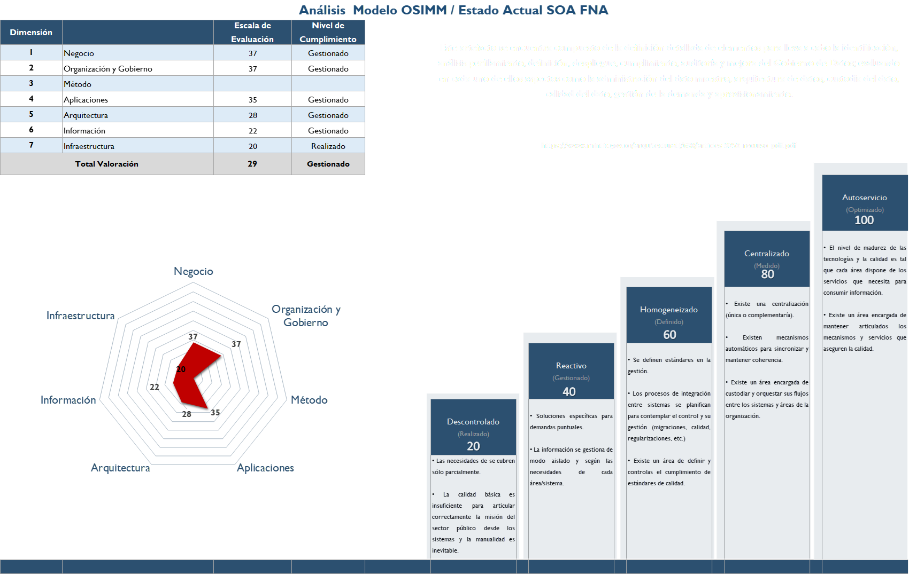
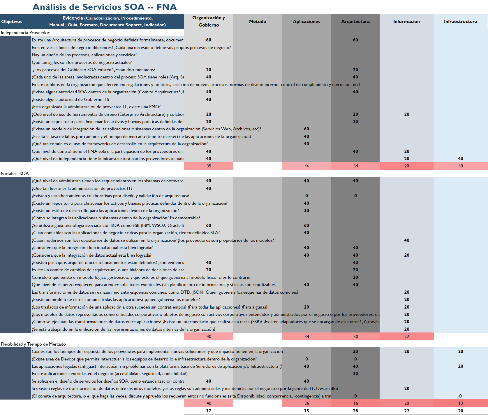

|Tema|Resultados y métricas del diagnóstico de madurez SOA: **Anexos. Todos los Dominios**
|----|-------------------------------------------------|
|Palabras clave|SOA, Madurez, Gobierno, Efectividad, Costos|
|Autor||
|Fuente||
|Version|$COMMIT del $FECHA_COMPILACION|
|Vínculos|[N005a. Vista de Integración FNA-1](N005a.%20Vista%2de%2Integración%2FNA-1.md) \| [Portafolio de Servicios SOA, Tipos de Servicios y Distribución de servicios SOA](N003e.%20Catálogo%20de%20Servicios%20FNA-3.md)|

 

## Anexo 1. Resultado Diagnóstico Madurez SOA

## Anexo 2. Diagnóstico Madurez SOA. Todas las Dimensiones

## Anexo 3. Diagnóstico Gobierno SOA. Por Desarrollar

