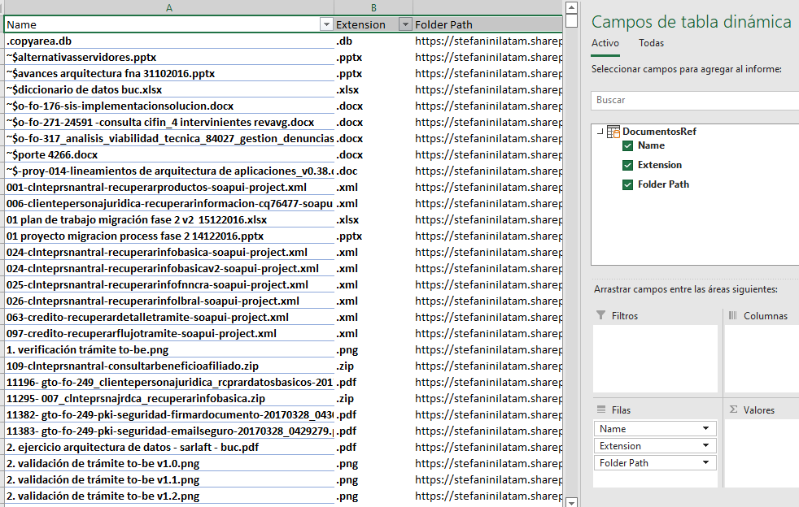

|Tema|Resultado del Diagnóstico Situación Actual SOA del FNA: **Oportunidades y Beneficios SOA Futuros**
|----|-------------------------------------------------|
|Palabras clave|SOA, Situación actual, Tecnología, Oportunidades, Proyectos|
|Autor||
|Fuente||
|Version|$COMMIT del $FECHA_COMPILACION|
|Vínculos||

 

## Oportunidad 1. Desarrollo de Servicios FNA Guiada por la Arquitectura de Referencia
Con base en el análisis de alineación SOA (ver [Resultado Diagnóstico Situación Actual-1](ResultadoDiagnósticoSituaciónActual-1), que muestra que el enfoque predominante no es el descendente, si no que, los servicios del portafolio del FNA provienen más de las aplicaciones de los proveedores que desde las vicepresidencia de Crédito o de Operaciones, tenemos la oportunidad de reforzar la arquitectura de referencia SOA del Fondo.

[Imagen. ]() Arquitectura de referencia como guía para el desarrollo del portafolio SOA.

_Fuente: elaboración propia._

 

La oportunidad de monitorear el desarrollo SOA con la arquitectura de referencia asegura una mejora alineación y focalización de los esfuerzos operativos (del día a día) y los de inversión de tecnología para el negocio (planes de mediano y largo plazo).

 

## Oportunidad 2. Desarrollo de Servicios FNA Guiada por la Arquitectura de Referencia
La problemática de la rigidez de cambio (entendida como el tiempo de mercado, o el tiempo que toma entregar a producción una mejora, cambio o funcionalidad), que también afecta a los servicios SOA objeto de este análisis, y que está evidenciada en los diagnósticos de  acomplamiento de las capacidades de negocio al proveedor [Resultado Diagnóstico Situación Actual-3](ResultadoDiagnósticoSituaciónActual-3.md), la prevalencia del enfoque ascendente (desde el provedor hacia negocio) [Resultado Diagnóstico Situación Actual-1a](ResultadoDiagnósticoSituaciónActual-1a.md), 

los diagnósticos anteriores  en aspectos como tecnilogía, decisiones de los tipos de servicios del portafolio del FNA,  de los servicios , reglas de negocio
Con base en el análisis de alineación SOA (ver [Resultado Diagnóstico Situación Actual-1](ResultadoDiagnósticoSituaciónActual-1), que muestra que el enfoque predominante no es el descendente, si no que, los servicios del portafolio del FNA provienen más de las aplicaciones de los proveedores que desde las vicepresidencia de Crédito o de Operaciones, tenemos la oportunidad de reforzar la arquitectura de referencia SOA del Fondo.

[Imagen. ]() Arquitectura de referencia como guía para el desarrollo del portafolio SOA.

_Fuente: elaboración propia._

 

La oportunidad de monitorear el desarrollo SOA con la arquitectura de referencia asegura una mejora alineación y focalización de los esfuerzos operativos (del día a día) y los de inversión de tecnología para el negocio (planes de mediano y largo plazo).

 

## Oportunidad 2. Mayor Utilización de la Tecnología SOA del FNA
Hay un campo grande de análisis para determinar con exactitud lo que señalamos en este diagnóstico inicial SOA del Fondo. Se trata del nivel de utilización de cada uno de las características de las plataformas, soluciones y productos de proveedor en los que el FNA invierte. 

Al momento no hay tal información en el repositorio del FNA

 

## Oportunidad 3. Gestión de la Tecnología (gobierno) por Medio de Arquitectura
Existe la oportunidad de impulsar la evolución de la alineación de la tecnología con las áreas misionales del Fondo dado a que el repositorio de arquitectura del FNA contiene información inicial para este objetivo (ver la tabla siguiente, clasificación de información del repositorio del Fondo). 

| **Contenidos FNA**                 |          |
|------------------------------------|----------|
| Servicios                          | **543**  |
| Arquitectura                       | 352      |
| Información                        | 248      |
| Aplicación                         | 107      |
| Funcional                          | 61       |
| **Total Contenidos FNA revisados** | **1311** |

[Tabla. ]() Clasificación de información del repositorio del FNA.

_Fuente: elaboración propia._

 

Sin embargo, antes de dar paso a la gestión de la tecnología para el negocio de FNA hay que subsanar estas problemática encontradas en la información de los modelos y conceptos del repositorio:

1. Redundancias y el atraso de la información de los modelos y conceptos. 
1. Incompletitud en el modelamiento de conceptos, como las capacidades de negocio, o los procesos de negocio del FNA.
1. Inconsistencia en el lenguaje de modelado. Falta estandarizar nombres y formas de representación de los mismo conceptos entre modelos.

 

Para apoyar la gestión de la alineación de la tecnología  del Fondo guíada por la arquitectura, hemos creado una herramienta de búsqueda, navegación y clasificación de los contenidos del repositorio del FNA

[Imagen. ]() Herramienta para navegación y clasificación de contenidos del FNA.

_Fuente: elaboración propia._
