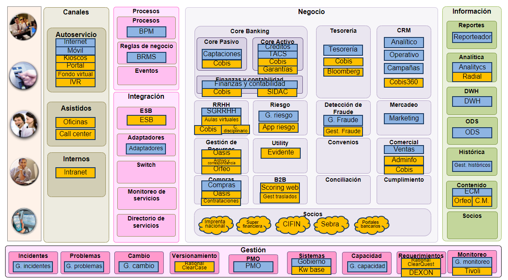

|Tema|Resultado del Diagnóstico Situación Actual SOA del FNA: **Análisis de huella y dependencia tecnologica SOA del FNA**
|----|-------------------------------------------------|
|Palabras clave|SOA, Situación actual, Tecnología|
|Autor||
|Fuente||
|Version|$COMMIT del $FECHA_COMPILACION|
|Vínculos||

 

## Análisis de Huella y Dependencia Tecnologica SOA del FNA

La dependencia de proveedor se extiende mas allá del hecho de que la lógica de negocio (backend) resida en el ERP Cobis, como lo expone el siguiente diagrama de capas de situación actual.

[Imagen. ]() Dependencia de proveedor y de tecnologías del FNA.

_Fuente: arquitectura fna.archimate_

 

>El problema real de la dependencia del proveedor de ERP Cobis es que este influye en ámbitos que se extienden a la tecnología del FNA e incide en las tecnologías seleccionadas sean las que lo favorecen primero al ERP y no a la arquitectura SOA del Fondo, que es la que procura objetivos más afines a la empresa, como la flexibilidad y otras fortalezas.

 

Muestra de que la huella tecnológica se centra en el ERP es el siguiente mapa de tecnologías. Este mapa evidencia que el monitoreo de servicios SOA y el desarrollo de directorios de servicios no tiene cobertura tecnológica; en cambio, la mayor cobertura tecnológica la tienen las áreas de Core Banking (en el diagrama), Tesorería y el CRM.

[Imagen. ]() Tecnologías que se desarrollan según el proveedor Cobis.

_Fuente: portafolio_aplicaciones_fna.pptx_

 

>**Nota**. El hecho de que no haya tecnologías para el monitoreo SOA y para la gestión de un registro empresarial de servicios del FNA, dificulta la implementación de beneficios de SOA, como la reutilización y la composición de servicios, y más bien, por el contrario, propicia la redundancia de las capacidades de la arquitectura SOA.

