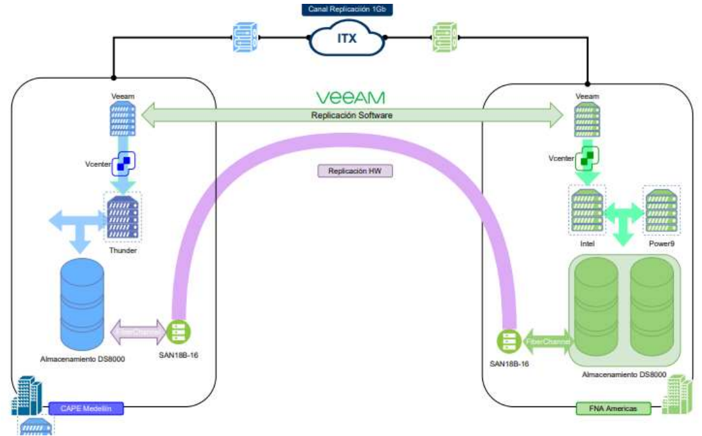

|Tema|Resultado del Diagnóstico Situación Actual SOA del FNA: **Análisis de huella y dependencia tecnologica SOA del FNA**
|----|-------------------------------------------------|
|Palabras clave|SOA, Situación actual, Tecnología|
|Autor||
|Fuente||
|Version|$COMMIT del $FECHA_COMPILACION|
|Vínculos||

 

## Análisis de Huella y Dependencia Tecnologica SOA del FNA

La dependencia de proveedor también se evidencia en el nivel de infraestructura con el fabricante IBM. Muchos de los servicios y hardware se encuentra proporcionado por este fabricante. A continuación mostramos la relación de servicios de infraestructura respecto de este fabricante. 

[Imagen. ]() Catálogo de tecnologías respecto a servicios de Infraestructura​ del FNA.

_Fuente: Composición de datos basado en arquitectura fna.archimate_

 

>La infraestructura actual ha sido influenciada por los productos del fabricante IBM, tanto a nivel de plataformas como de tecnologías y soluciones. Esto implica riesgos de esfuerzos altos en el caso de portar de tecnología, actualizar, o sustituir los entornos de ejecución, sistema operativo o arquitectura de procesador.

 

La infraestructura actual fue y sigue siendo influenciada por los productos del fabricante IBM, adicional esta infraestructura ha influenciado el plan de recuperación de desastres.

[Imagen. ]() Centro Alterno.

_Fuente: CAPE.pdf_

 

>Es importante asignarle al ‘CAPE’ un lugar dentro de la documentación de arquitectura, ya que actualmente es un elemento “transparente” para la operación de la solución actual; sin embargo, cuando se pretenda implementar arquitecturas nuevas puede limitar el tipo de tecnologías o proveedores que se puedan elegir.

