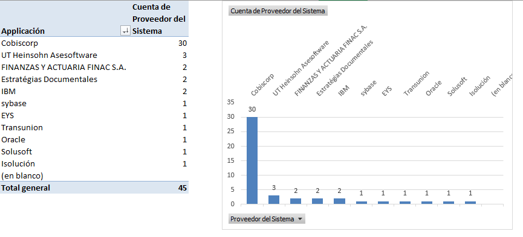

|Tema|Resultado del Diagnóstico Situación Actual SOA del FNA: **Análisis de Gobierno SOA**
|----|-------------------------------------------------|
|Palabras clave|SOA, Situación actual, Tecnología, Gobierno, Efectividad|
|Autor||
|Fuente||
|Version|$COMMIT del $FECHA_COMPILACION|
|Vínculos||

 

## Análisis de Gobierno SOA del FNA
Uno de los principales valores que un Gobierno entrega es la identificación y la gestión de las acciones para controlar los riesgos. En el caso de este ejercicio de diagnóstico tratamos los riesgos de tecnología y de arquitectura SOA del FNA. A continuación identificaremos los riesgos que ameritan reforzar el gobierno SOA del Fondo.

### Riesgo de Inefectividad Tecnológica (versus beneficios SOA)
Parte importante de la tecnología del Fondo está reflejada en sus aplicaciones y plataforma de software (ver imagen siguiente). _Las aplicaciones de proveedor, entre los que se encuentran Transunion, Solusoft, Isolution, y por supuesto, el ERP Cobis, tienen la mayor presencia en el listado de tecnologías_, seguido esta de los productos de grandes fabricantes como el bus de IBM, y las bases de datos de Oracle y Sybase.

[Imagen. ]() Listado de tecnologías de software del FNA.

_Fuente: catalogo de Aplicaciones URL.xlsx._

 

Nota: el Process Server, componente que tiene un nivel de utilización considerable en el FNA no aparece en este corte, dado que no es una aplicación. Aún así, a este componente le aplique de igual manera este riesgo señalado.

 

>**Importante**. Existe el riesgo de inefectividad tecnológica respecto a SOA. En consistencia con esta lista de tecnologías y proveedores y este riesgo señalado, el resultado del diagnóstico de madurez SOA indica que el FNA no pasa del segundo escalafón en esta la eficacia SOA de OSIMM.

El riesgo de inefectividad tecnológica respecto a SOA se configura cuando el nivel de inversión en tecnología de software riñe con los resultados de los diagnósticos de eficacia, como los que realizamos en este ejercicio. 

 

>Es tarea primordial del futuro gobierno SOA el balancear la eficacia de las inversiones de tecnología de software del FNA con el desempeño SOA de la empresa;  prevenir, incluso, las inversiones si estos desbalances existieran, y en consecuencia, impulsar primero el avance de la madurez del portafolio de servicios para aprovechar mejor la planta instalada del FNA.

 

Según el diagnóstico de la situación actual del FNA, el futuro gobierno SOA, debe: 
1. Vigilar y aumentar las capacidades de la arquitectura SOA.
1. Mantener el balance entre el desarrollo de los procesos SOA y el desarrollo de las capacidades de la arquitectura SOA.
1. Procurar los índices de eficacia (madurez) de la arquitectura y de los procesos SOA, no sólo de los servicios SOA.

