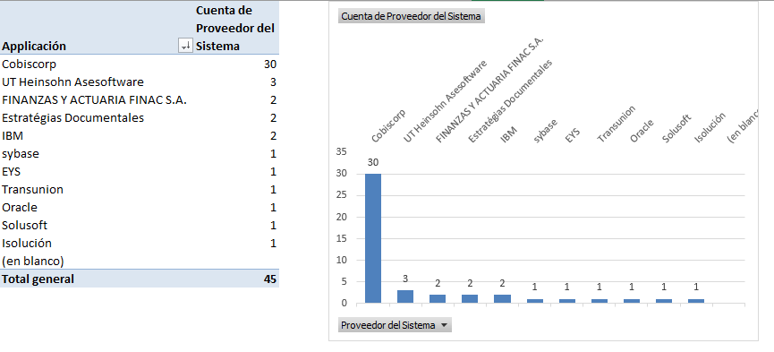

|Tema|Diagnóstico SOA FNA: **Conclusiones Relevantes de Fase 1**|
|----|---------------------------------------------------------------------------|
|Palabras clave|SOA, Conclusiones, Problemas, Objetivos
|Autor||
|Fuente||
|Version|$COMMIT del $FECHA_COMPILACION|
|Vínculos|[N001d. Ejecución Plan de Trabajo SOA](onenote:#N001d.%20Ejecución%20Plan%20de%20Trabajo%20SOA&section-id={F3AC64B8-D6FF-47C7-ABBE-A2B4B6510F0F}&page-id={45CC9047-3DB4-4CFD-BCA1-D9619F4A0C4D}&end&base-path=https://uniandes-my.sharepoint.com/personal/ha_wong10_uniandes_edu_co/Documents/Blocs%20de%20notas/Harry%20Alfredo%20@%20Work/SOA/Trabajo%20SOA.one), [N003a. Procesos de Negocio FNA](onenote:#N003a.%20Procesos%20de%20Negocio%20FNA&section-id={F3AC64B8-D6FF-47C7-ABBE-A2B4B6510F0F}&page-id={DAE4ECE3-B936-461D-A468-83492014F7F7}&end&base-path=https://uniandes-my.sharepoint.com/personal/ha_wong10_uniandes_edu_co/Documents/Blocs%20de%20notas/Harry%20Alfredo%20@%20Work/SOA/Trabajo%20SOA.one)|
|||

 

## 1. Alineación Mediante la Relación Capacidades-Servicios SOA
Para conseguir la alineación definitiva de negocio del FNA, de las áreas seleccionadas por este ejercicio, y de los requerimientos funcionales y de mejora con los servicios SOA _es imperativo desarrollar el modelo de capacidades de negocio del FNA_. Desarrollar formalmente el modelo de capacidades, y profundizar en sus relaciones con las demás partes de la empresa, que incluye a los servicios SOA, hace posible el enfocar los esfuerzos, los análisis, asignar recursos y aplicar controles exclusivos en aquellas partes más cercanas a estas capacidades, y que por ende son las tienden a liberan el mayor valor e impacto positivo para el Fondo. Lo contrario a esto sería desarrollar todo basado en la percepción: desarrollar todo lo que sea percibido en su momento como importante, y después cambiar de objetivo cuando surja uno que tenga mejor percepción.

[Imagen.]() Desarrollo y profundización de las capacidades del FNA propuestas. Existen pocas las relaciones entre las capacidades de negocio y los servicios SOA del Fondo.

 

## 2. Alineación Mediante Clasificación del Portafolio de Servicios SOA del FNA
El otro indicio de alineación SOA con el negocio viene esta vez de mano del portafolio de servicios del Fondo. _Viendo la tabla de la distribución actual de los servicios del portafolio sobresale que se encuentra inclinada hacia los servicios de información_. Esto puede significar que las necesidades de negocio de las vicepresidencias de Crédito y de Operaciones están siendo satisfechas en mayor grado por este tipo de servicios, que con servicios de negocio o de proceso.

|||
|---------------|:--:|
|**Tipo Servicio**|**Cantidad**|
|Servicio Información|**55**|
|Servicio Proceso|18|
|Servicio Negocio|14|
|**Total general**|**87**|

[Tabla.]() Catalogación de los tipos de servicios SOA del FNA.

 

## 3. Análisis de Huella y Dependencia Tecnologica SOA del FNA No. 1
El problema real de la dependencia del proveedor de ERP Cobis es que este influye en ámbitos que se extienden a la tecnología del FNA, e incide en que las tecnologías seleccionadas sean las que lo favorecen primero al ERP, y no tanto a la arquitectura SOA del Fondo, que es la que procura objetivos más afines a la empresa, como la flexibilidad y otras fortalezas.

El hecho de que no haya evidencias de que las capacidades tecnológicas para el monitoreo SOA y para la gestión de un registro empresarial de servicios del FNA esté encendidas, dificulta la implementación de beneficios de SOA, como la reutilización y la composición de servicios. Por el contrario, esto propicia la redundancia de las capacidades de la arquitectura SOA.

 

## 4. Análisis de Huella y Dependencia Tecnológica SOA del FNA No. 2
La dependencia de proveedor también se evidencia en el nivel de infraestructura con el fabricante IBM. 

[Imagen. ]() Catálogo de tecnologías respecto a servicios de Infraestructura​ del FNA.

_Fuente: Composición de datos basado en arquitectura fna.archimate_

 

La infraestructura actual ha sido influenciada por los productos del fabricante IBM, tanto a nivel de plataformas como de tecnologías y soluciones. Esto implica riesgos de esfuerzos altos en el caso de portar de tecnología, actualizar, o sustituir los entornos de ejecución, sistema operativo o arquitectura de procesador.

Es importante asignarle al ‘CAPE’ un lugar dentro de la documentación de arquitectura, ya que actualmente es un elemento “transparente” para la operación de la solución actual; sin embargo, cuando se pretenda implementar arquitecturas nuevas puede limitar el tipo de tecnologías o proveedores que se puedan elegir.

 

## 5. Análisis de Gobierno SOA del FNA
A continuación identificaremos los riesgos que ameritan reforzar el gobierno SOA del Fondo.

### Riesgo de Inefectividad Tecnológica (versus beneficios SOA)
Parte importante de la tecnología del Fondo está reflejada en sus aplicaciones y plataforma de software (ver imagen siguiente). Las aplicaciones de proveedor, entre los que se encuentran Transunion, Solusoft, Isolution, y por supuesto, el ERP Cobis, tienen la mayor presencia en el listado de tecnologías, seguido esta de los productos de grandes fabricantes como el bus de IBM, y las bases de datos de Oracle y Sybase.

[Imagen. ]() Listado de tecnologías de software del FNA.

_Fuente: catalogo de Aplicaciones URL.xlsx._

 

El Process Server, componente que tiene un nivel de utilización considerable en el FNA no aparece en este corte, dado que no es una aplicación. Aún así, a este componente le aplica de igual manera este riesgo señalado.

### Riesgo de Vigilancia de Soluciones SOA (versus beneficios SOA)
Con base en el análisis de alineación SOA (ver [Resultado Diagnóstico Situación Actual-1](ResultadoDiagnósticoSituaciónActual-1), que muestra que el enfoque predominante no es el descendente, si no que, _la implementación de los servicios del portafolio del FNA provienen más de las aplicaciones de los proveedores que desde las vicepresidencia de Crédito o de la de Operaciones_, existe el riesgo (y la oportinidad de reforzar el gobierno SOA) de que las soluciones no sean las que el equipo de arquitectura, TI, o el que haga las veces de gestor de las tecnologías en el Fondo, pueda reforzar la arquitectura de referencia SOA del Fondo.

 

## 6. Análisis de las Fortalezas SOA del FNA
Para mejorar las fortalezas SOA es necesario subsanar los problemas de acoplamiento del proveedor Cobis a las capacidades de negocio del FNA, y mantener bajo control los grados de dependencia de los servicios SOA que evidenció la revisión del portafolio de servicios SOA del FNA. Pero también existen otras problemáticas de igual importancia.

### Acoplamiento de las capacidades de negocio del FNA a Cobis
_Existen más de 96 relaciones_ entre las capacidades de negocio y las herramientas de software de Cobis (ver [N003e. Catálogo de Servicios FNA-1](N003e.CatálogodeServiciosFNA-1.md), y [N003e. Catálogo de Servicios FNA-2](N003e.CatálogodeServiciosFNA-2.md)). 

    Todo acoplamiento, que en este caso es con el proveedor, produce rigidez. Esta  rigidez es causa de una problemática que afecta, en primer grado a la flexibilidad de negocio, y segundo, al tiempo de mercado.

### Relación de dependencia de las aplicaciones proveedoras
El grado de relación de dependencia de las aplicaciones proveedoras de servicios es alto y requiere de intervención y un gobierno que prevenga y controle su aumento. Esta situación tiene equivalencia en otra rama de la gestión: en la gestión de bases de datos  suce de que la proliferación de índices, que aumentan el desempeño de las operaciones de consulta, degrada el desempeño de las operaciones de modificación. El administrador de base de datos debe impedir que la creación de índices afecte al desempeño de la base. Similar situación ocurre en el portafolio SOA del Fondo. El aumento de la cantidad de relaciones entre los servicios del portafolio causa problemas, no tanto de degradación, sino de mantenimiento y rigidez al cambio. _Aplicaciones como Cobis Clientes y Cobis Cartera suman más de 60 relaciones con otros servicios_ (ver [N003e. Catálogo de Servicios FNA-2.md](N003e.CatálogodeServiciosFNA-2.md)). _En total, el grupo de aplicaciones de Cobis suma más de 100 relaciones a servicios SOA del portafolio del Fondo_. 

    Esto implica que los esfuerzos de realizar cambios evolutivos, optimización, o de mantenimiento se acrecienten: un cambio en una aplicación con alto grado de dependencia requiere asegurar la calidad (QA) de las n-relaciones que esta tenga con los servicios del portafolio SOA. Lo mismo que termina efectando al tiempo de mercado.

Relaciones entre servicios SOA del portafolio y relaciones de servicios con aplicaciones del Fondo.

[Imagen. ]() Interdependencias del Portafolio FNA.

_Fuente: Portafolio Unificado Servvicios FNA 0.0.1.xlsx_

 

### Débil Relación con requerimientos de negocio (VP de Crédito y Operaciones)
Por último, y al contrario de la cantidad creciente de relaciones de los servicios por administrar (más de 100 relaciones de aplicaciones a servicios), _el nivel de relación de los servicios con los requerimientos de las vicepresidencias de Crédito y la vicepresidencia de Operaciones evidenciada en los modelos del FNA es baja_ (ver [N003e. Catálogo de Servicios FNA-1a](N003e.CatálogodeServicios.md)). 

    La baja relación de los requerimientos con las áreas complica la gestión de las demanda y afecta a la eficacia del portafolio de servicios que empieza a llenarse de servicios de tipo intermediarios o servicios utilitarios, que terminan consumiento  mayores recursos que los servicios de negocio, que son los que responden a las áreas de negocio en sus términos.

 

## 7. Desarrollo de la Arquitectura de referencia
Los modelos del FNA carecen de información de los conectores entre las capacidades de negocio del FNA. Esto impacta la manera cómo una capacidad soporta a otra, a la vez que dificulta controlar las tecnologías y estándares involucradas en tales conexiones.

No es evidenciable la relación de capacidades de negocio y los servicios SOA. Esto impacta a la gestión del portafolio de servicios, particularmente, el crecimiento de los tipos de servicios utilitarios a expensas de los de negocio y composición. 

