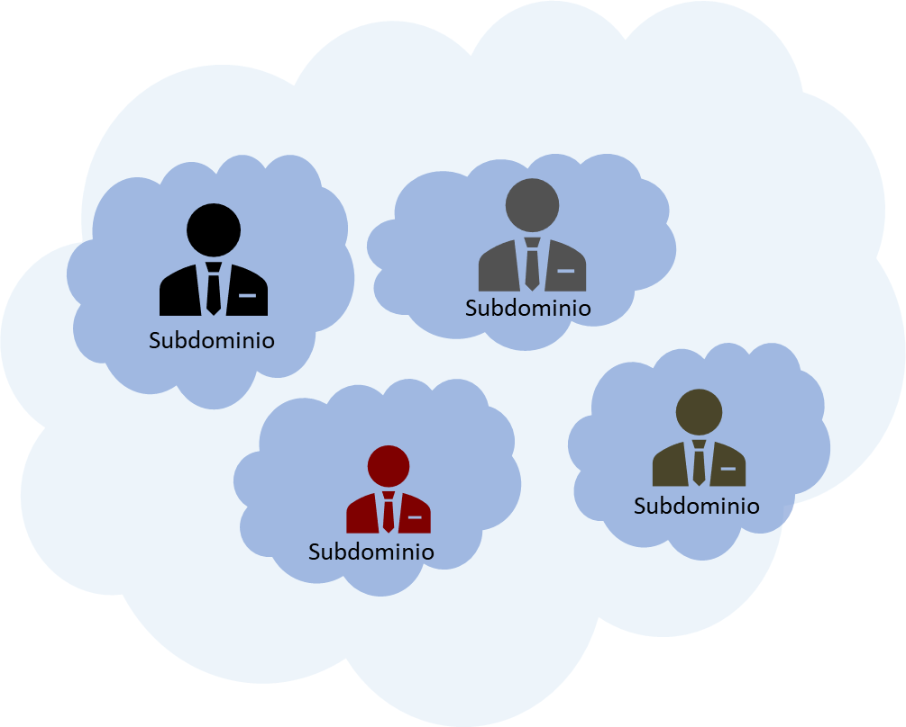
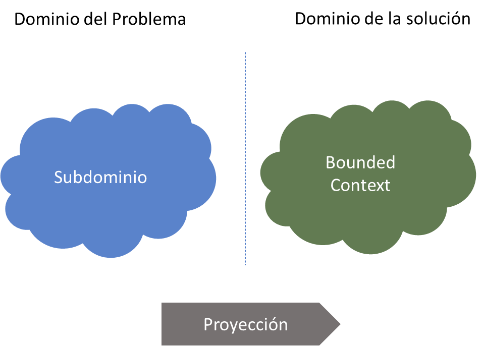
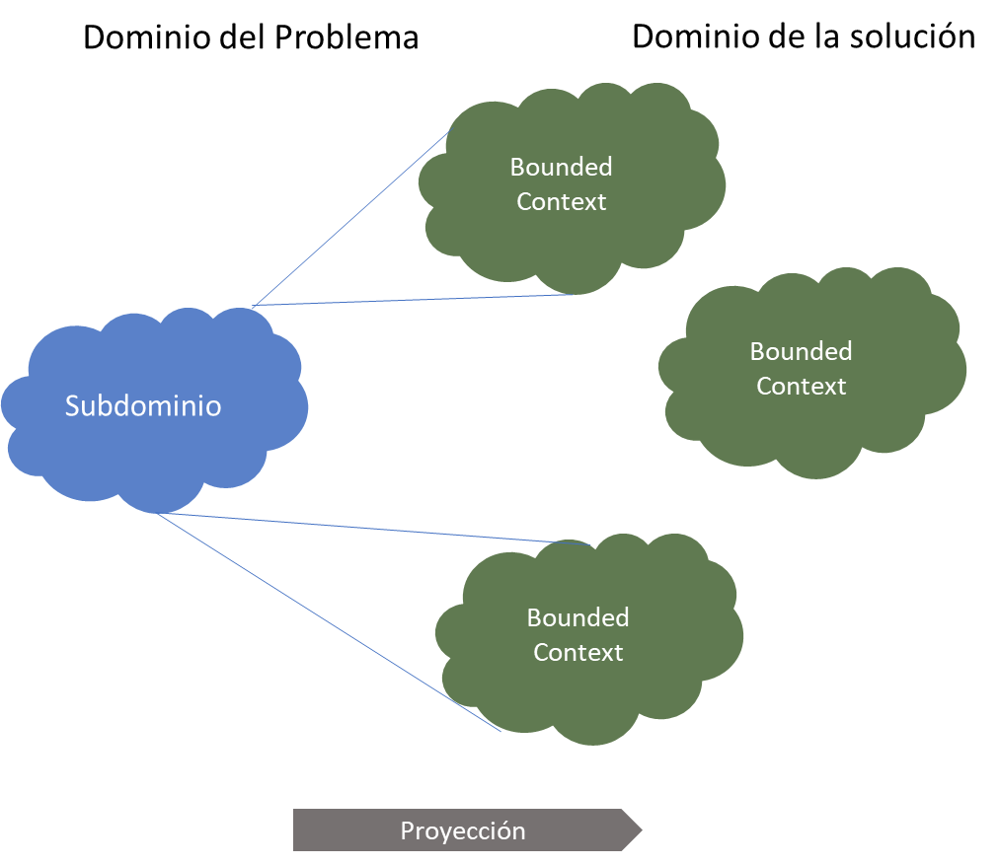
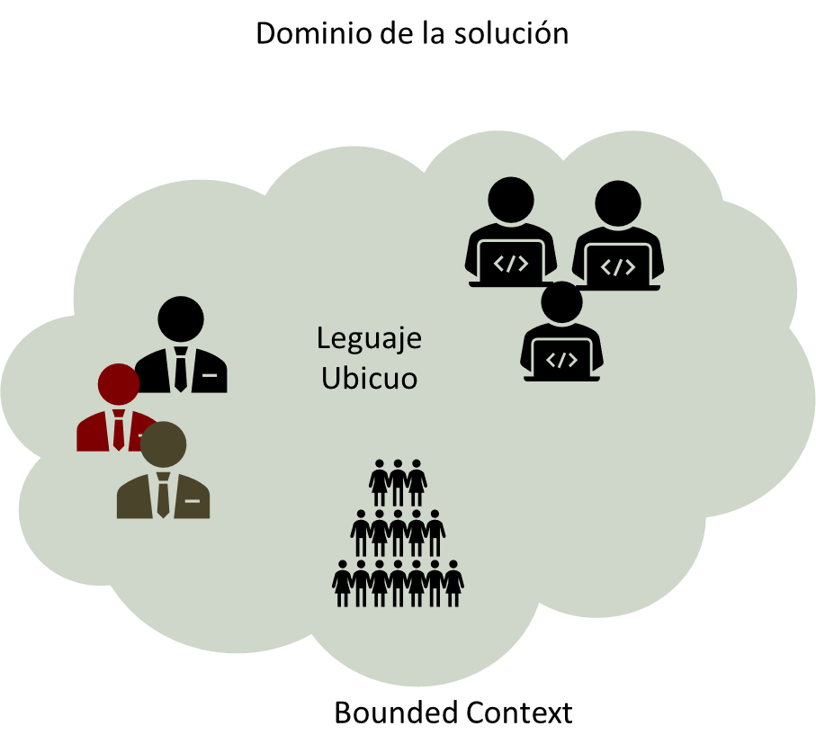
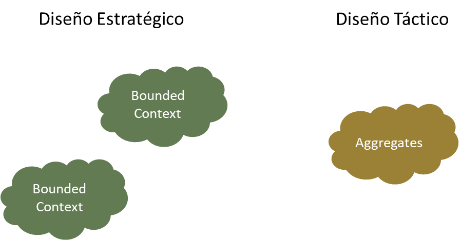
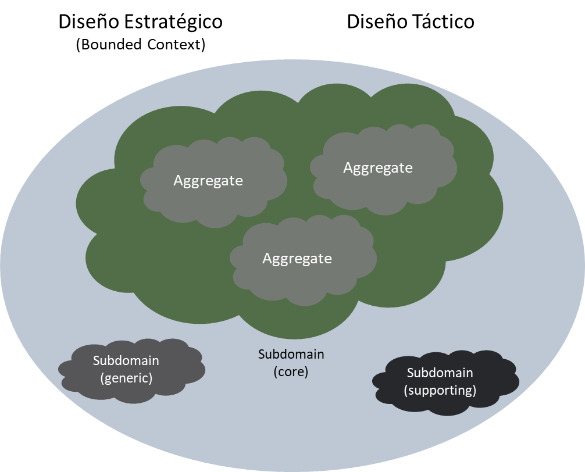
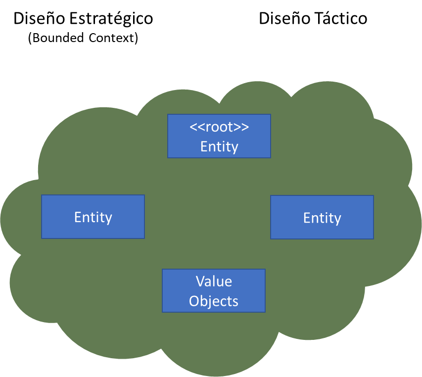

|Tema|Vigilancia Avances de Industria: **Estrategia de modelado e identificación de servicios**
|----|-------------------------------------------------|
|Palabras clave|SOA, Tecnologías, Vigilancia, Avances|
|Autor||
|Fuente||
|Secuencia|Padre \| Hijo|
|Vínculos|[N003a Vista Segmento SOA FNA](N03a%a20Vsta%20aSegenta%20SOA%20FNA.md)|

 

# Estrategia de modelado e identificación de servicios 

## Domain-Driven Design
Una de las principales estrategias de diseño de arquitecturas orientadas a servicios / microservicios, es la de reemplazar la búsqueda de reutilización por la facilidad de mantenimiento de los servicios.

En SOA es usual propender por servicios que puedan ser reutilizados a lo largo de toda la organización y en diferentes aplicaciones.  El ojetivo es que un servicio pueda solucionar necesidades de diferentes unidades organizacionales y diferentes procesos de negocio, esto implica usualmente servicios que manejan formatos canónicos y tienen reglas de negocio bastante particulares para solucionar casos puntuales y específicos de las unidades de negocio.  Si bien en un principio se veía esta reutilización como algo favorable, normalmente implicaba un desbalance con la facilidad de modificación.  Un cambio en una regla de negocio implica un versionamiento del servicio y afectar a todos los usuarios del servicio.

Una propuesta diferente que se está utilizando actualmente es la de modelar los servicios a partir de estrategias como Domain-Driven Design o DDD. En esta propuesta se busca tener servicios dedicados al dominio así no sean reutilizados

DDD reconoce los dominios y subdominios de negocio como elemento fundamental para la estrategia de servicios. Se busca tener una alineación entre negocio y tecnología, comenzando por los subdominios de negocio de la organización.

[Imagen. ]() Ilustración Domain-Driven Design.

_Fuente: elaboración propia._

 

Los subdominios pueden ser clasificados en subdominios Core, Soporte y General. El subdominio Core representa lo misional de la organización, los de soporte, representan servicios generales y transversales a las organizaciones y los generales los orientados a las unidades de negocio no core.

[Imagen. ]() Ilustración Domain-Driven Design.

_Fuente: elaboración propia._

 

Una vez se identifican los subdominios de la organización se hace una relación entre subdominio y los llamados contexto acotados. Los contexto acotados pueden verse como agrupaciones de servicios asociadas a subdominios de la organización

Es posible que un subdominio de negocio tenga asociados varios contextos acotados, es decir que el subdominio se represente con agrupaciones de servicios separadas pero asociadas a un mismo concepto de negocio.

[Imagen. ]() Ilustración Domain-Driven Design.

_Fuente: elaboración propia._

 

Una característica de un contexto acotado es el uso de un lenguaje ubicuo.  Esto quiere decir que conceptos como cliente, producto o servicio, pueden tener significados diferentes en diferentes contextos acotados.

Lo anterior hace que ya no se busque encapsular en un solo servicio, por ejemplo cliente, todas las posibles reglas de negocio de la organización, sino que existan diferentes servicios Cliente, con funcionalidades más pequeñas y acotadas, en cada contexto. Esto hace que se pierda la reutilización pero se gana en mantenimiento de la solución.

[Imagen. ]() Ilustración Domain-Driven Design.

_Fuente: elaboración propia._

 

El proceso de identificación de los contextos acotados y sus lenguajes ubicuos se denomina diseño estratégico. Como se ha explicado, el diseño estratégico identifica agrupaciones de servicios.

La siguiente fase es la del diseño táctico. En esta fase, se identifican componentes más pequeños denominados agregados. Los agregados se pueden ver como las unidades de implementación en SOA, es decir los servicios. Un agregado es usualmente un servicio.

[Imagen. ]() Ilustración Domain-Driven Design.

_Fuente: elaboración propia._

 

El conjunto de agregados irán conformando el portafolio de servicios de la organización.

[Imagen. ]() Ilustración Domain-Driven Design.

_Fuente: elaboración propia._

 

* Entity. Modela un elemento de forma individual Tiene un identificador único.
* Value Objects. Modela un concepto inmmutable, el cual no tiene identificador único. Usualmente se usa para describir, cuantificar o medir un Entity.
* \<\<root>> Entity. Da el nombre a la agregación y contiene todos los otros elementos (entidades y values). Es el único punto de entrada a la agregación.

[Imagen. ]() Ilustración Domain-Driven Design.

_Fuente: elaboración propia._

 

Por último, cada Aggregate, forma una frontera transaccional. Al interior todo las partes son consistentes.

1. Las innvariantes de negocio se protegen dentro de un Aggregate
1. Propender por diseñar Aggregates pequeños
1. Solo se referencian otros aggregates por su identificador
1. Los Aggregates se actualizan mediante la consistencia eventual

